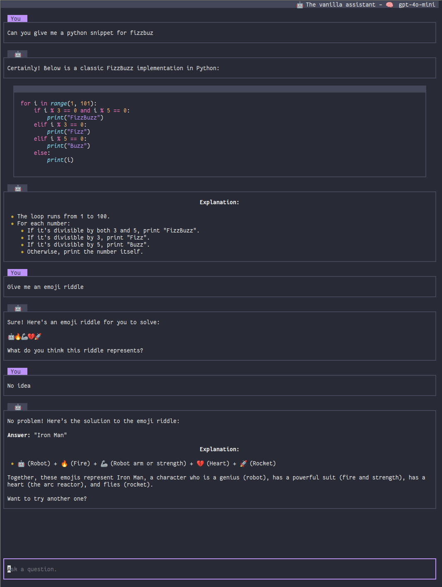

# CLAI



I minimalist terminal chat client for llm that works for me.

# Features

- Streaming responses.
- Renders Markdown.
- Supports: OpenAI, Anthropic and Ollama.
- Supports assistant profiles.

# Run

```
uv sync
./clai.py --help
```
